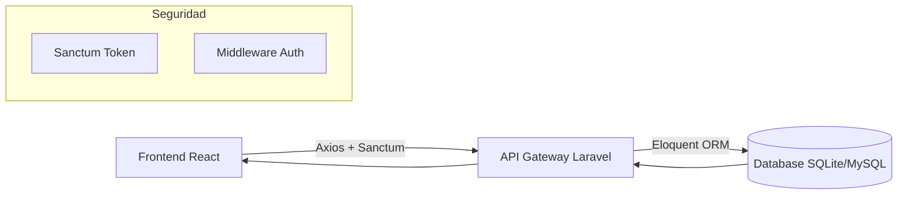

# Sistema de Información Gerencial para la Gestión Integrada del Flujo Turístico en la Provincia de Cusco

---

## 📖 1. Resumen Ejecutivo
Este proyecto es una plataforma de **Business Intelligence (BI)** y gestión operativa diseñada específicamente para la **Municipalidad Provincial del Cusco**. Su objetivo es centralizar la información dispersa del sector turístico para permitir una toma de decisiones basada en datos reales, optimizando el flujo de visitantes y la fiscalización de servicios.

---

## 🏗️ 2. Arquitectura del Sistema

El sistema utiliza una arquitectura de **Desacoplamiento Total** entre el Cliente y el Servidor.

### 2.1. Flujo de Datos

---

## 🖥️ 3. Guía Detallada de Módulos y Páginas

El sistema se divide en 5 módulos principales, cada uno diseñado con una interfaz **Premium Glassmorphism** que prioriza la legibilidad y la estética moderna.

### 📊 3.1. Dashboard (Centro de Control Gerencial)
Es el núcleo del sistema, donde se consolidan los indicadores clave de desempeño (KPIs).
*   **Monitor de Capacidad en Tiempo Real:** Integración con **Google Maps API** configurado con filtros de contraste personalizados (Modo Oscuro Adaptativo) para visualizar los puntos críticos de Cusco.
*   **Tarjetas de Resumen (Counters):** Muestra el conteo total de visitantes hoy, sitios operativos, operadores activos y guías disponibles.
*   **Gráficos Estadísticos:** Implementación de gráficos circulares y de barras (Recharts) que muestran la proporción de visitantes extranjeros vs. nacionales y la tendencia de ocupación semanal.
*   **UI/UX:** Paneles traslúcidos con bordes sutiles y efectos de iluminación dinámica.

### 👤 3.2. Registro de Visitantes (Flujo de Ingresos)
Módulo crítico para el control de la demanda turística.
*   **Tabla de Gestión Avanzada:** Listado paginado con carga asíncrona que muestra nombre, documento, nacionalidad y sitio de destino.
*   **Buscador Inteligente:** Filtro en tiempo real por nombre o número de documento.
*   **Modal de Registro "Entrada":** Formulario de alta velocidad para registrar nuevos ingresos. Incluye:
    *   Validación de tipo de visitante (Etiquetas visuales Verde/Azul).
    *   Selección dinámica de sitios arqueológicos desde la base de datos.
    *   Registro automático de hora y fecha de ingreso.
*   **Indicadores Visuales:** Badges estilizados para diferenciar rápidamente el origen del turista.

### 🏺 3.3. Sitios Turísticos (Gestión de Atractivos)
Monitoreo de la oferta cultural y natural de la provincia.
*   **Vista de Rejilla (Grid):** Tarjetas interactivas para cada atractivo (Ej. Machu Picchu, Sacsayhuaman, Ollantaytambo).
*   **Indicadores de Capacidad:** Visualización clara del aforo máximo permitido por sitio.
*   **Estados Operativos:** Etiquetas de estado dinámicas: `Operativo` (Verde), `Mantenimiento` (Amarillo), `Cerrado` (Rojo).
*   **Modal de Nuevo Sitio:** Permite dar de alta nuevos atractivos definiendo su categoría (Arqueológico, Natural, Museo) y capacidad de carga.

### 🏢 3.4. Operadores Turísticos (Directorio de Servicios)
Herramienta de fiscalización y gestión de la oferta privada formal.
*   **Fichas de Empresa:** Visualización detallada de cada agencia o establecimiento de hospedaje.
*   **Validación de RUC:** Espacio dedicado para el registro de los 11 dígitos fiscales.
*   **Contactabilidad:** Acceso rápido a Email y Teléfono de cada operador registrado.
*   **Control de Licencias:** Seguimiento visual de la vigencia de la licencia DIRCETUR.
*   **Filtros por Tipo:** Diferenciación entre Agencias de Viajes, Hoteles y Transporte Turístico.

### 🎓 3.5. Guías Certificados (Gestión de Profesionales)
Directorio de guías autorizados para operar en la región.
*   **Perfiles Profesionales:** Tarjetas tipo "Badge" con la foto (Avatar Award) y nombre del guía.
*   **Gestión de Idiomas:** Visualización de las competencias lingüísticas (Ej. Inglés, Francés, Quechua).
*   **Especialidades:** Etiquetas de especialidad como "Arqueología", "Aventura" o "Gastronomía".
*   **Seguimiento de Licencias:** Registro del número de carnet y fecha de vencimiento profesional.
*   **Modal de Registro:** Formulario optimizado para el alta de nuevos guías con selección de múltiples idiomas.

---

## 🗄️ 6. Base de Datos y Replicación

Para asegurar que todos los desarrolladores y evaluadores cuenten con la misma información, la base de datos se distribuye mediante **Migraciones** y **Seeders** (Siembras).

### 6.1. Esquema de Datos
El sistema utiliza un modelo relacional normalizado:
*   **Migraciones:** Ubicadas en `backend/database/migrations/`, definen la estructura de tablas, tipos de datos e índices.
*   **Seeders:** Ubicados en `backend/database/seeders/`, contienen la lógica para poblar el sistema.

### 6.2. Generación de Datos Masivos
El proyecto incluye un `TestDataSeeder` avanzado que utiliza la librería **Faker** (localizada en `es_PE`) para inyectar:
*   **300+ Visitantes** con nombres, documentos y procedencias realistas.
*   **60 Operadores** con RUCs y licencias simuladas.
*   **50 Guías** con combinaciones aleatorias de idiomas y especialidades.

> [!TIP]
> Para reconstruir la base de datos completa con todos los datos de prueba, ejecute:
> `php artisan migrate:fresh --seed`

---

## 💻 7. Stack Tecnológico Detallado

### 7.1. Frontend
*   **React 19:** Última versión con mejoras en el manejo de concurrencia.
*   **Tailwind CSS 4:** Estilizado mediante variables CSS modernas y utilidades de espaciado dinámico.
*   **Zustand:** Gestión de estado global con persistencia local para mantener la sesión del usuario.
*   **Axios:** Cliente HTTP con interceptores para inyectar automáticamente el token de autenticación Sanctum en cada petición.

### 4.2. Backend
*   **Laravel 11:** Arquitectura de API limpia y escalable.
*   **Eloquent ORM:** Relaciones complejas (Many-to-One) entre Visitantes y Sitios Turísticos.
*   **FakerPHP Custom Seeder:** Lógica personalizada para generar 300+ registros masivos con coherencia geográfica y temporal.
*   **Laravel Sanctum:** Sistema de autenticación ligero basado en tokens para asegurar que solo usuarios autorizados accedan a la información gerencial.

---

## 🛠️ 5. Instrucciones de Despliegue

### Configuración del Servidor (Backend)
1.  Clonar y entrar a `/backend`.
2.  `composer install`
3.  `cp .env.example .env` (Asegurar `DB_CONNECTION=sqlite`).
4.  `touch database/database.sqlite`
5.  `php artisan migrate:fresh --seed` (Esto poblará el sistema con los **300+ registros de prueba**).
6.  `php artisan serve --port=8001`

### Configuración del Cliente (Frontend)
1.  Entrar a `/frontend`.
2.  `npm install`
3.  `npm run dev` (Abrirá la interfaz en `http://localhost:5173`).

---

## 📈 6. Impacto Institucional
La implementación de este SIG permite a la gestión municipal de Cusco pasar de una **reacción basada en intuición** a una **planificación basada en evidencia**, cumpliendo con los estándares de interoperabilidad del Estado Peruano.

**Cusco - Ombligo del Mundo 🌍**