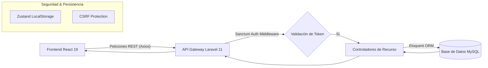

# Sistema de Información Gerencial para la Gestión Integrada del Flujo Turístico en la Provincia de Cusco

[](https://laravel.com/)
[](https://react.dev/)
[](https://www.typescriptlang.org/)
[](https://tailwindcss.com/)
[](https://www.mysql.com/)

---

## 📖 1. Resumen Ejecutivo
Este proyecto es una plataforma de **Business Intelligence (BI)** y gestión operativa diseñada para la **Municipalidad Provincial del Cusco**. Su objetivo es centralizar la información dispersa del sector turístico para permitir una toma de decisiones basada en datos reales, optimizando el flujo de visitantes y la fiscalización de servicios mediante una arquitectura moderna de Sistemas de Información Gerencial (SIG).

---

## 🏗️ 2. Arquitectura del Sistema (Full Stack)

El sistema utiliza una arquitectura de **Desacoplamiento Total** basada en el patrón de diseño Cliente-Servidor, lo que garantiza escalabilidad e independencia tecnológica.

### 2.1. Diagrama de Flujo de Datos


---

## 💻 3. Stack Tecnológico de Vanguardia

### 3.1. Frontend (Interfaz de Usuario Premium)
*   **React 19 (SPA):** Utiliza el nuevo compilador de React y mejoras en el manejo de transiciones para una experiencia de usuario fluida sin recargas de página.
*   **TypeScript 5:** Tipado estricto en toda la aplicación, desde las interfaces de la API hasta las propiedades de los componentes, garantizando un código libre de errores de referencia.
*   **Tailwind CSS 4 + Shadcn UI:** Arquitectura visual basada en **Glassmorphism**. Se utilizan efectos de `backdrop-blur`, gradientes complejos (Linear & Radial) y una paleta de colores curada para el sector gubernamental/turístico.
*   **Zustand con Persist Middleware:** Gestión de estado global que mantiene la sesión del usuario (Token Sanctum) persistente incluso tras recargar el navegador.
*   **Axios Interceptors:** Capa de comunicación que intercepta cada petición saliente para inyectar el Header `Authorization: Bearer [token]` y maneja globalmente los errores 401 (Sesión expirada).
*   **Lucide React:** Sistema de iconos vectoriales ligeros que mantienen la consistencia visual en todos los módulos.
*   **Recharts:** Librería de visualización de datos de alto rendimiento para la generación de dashboards estadísticos.

### 3.2. Backend (Arquitectura de Microservicios API)
*   **Laravel 11:** El framework PHP más avanzado del mercado, configurado en modo API-only para minimizar el overhead de memoria.
*   **Laravel Sanctum:** Implementación de autenticación mediante tokens de acceso personal para asegurar las rutas críticas del sistema.
*   **Eloquent ORM:** Implementación de relaciones complejas como `BelongsTo` y `HasMany` para vincular visitantes con sus respectivos atractivos turísticos de manera eficiente.
*   **Validación de Datos (Request Validation):** Capa de seguridad que filtra y valida cada entrada de datos (RUC de 11 dígitos, formatos de fecha ISO, tipos de documento) antes de llegar a la base de datos.
*   **FakerPHP Customization:** Generación de datos masivos (Siembra) con localización en `es_PE` para nombres, empresas y distritos cusqueños realistas.

---

## 🗄️ 4. Especificación Detallada de la Base de Datos (MySQL)

El sistema utiliza **MySQL** como motor de persistencia relacional, garantizando la integridad referencial y la capacidad de manejar miles de registros simultáneos.

### 4.1. Entidades y Esquema de Datos
| Tabla | Propósito | Campos Críticos |
| :--- | :--- | :--- |
| **Visitors** | Registro de ingresos | `full_name`, `document_number`, `visitor_type`, `nationality`, `site_id`, `entry_date`, `ticket_number` |
| **Tourist_Sites** | Atractivos turísticos | `name`, `category`, `location`, `capacity_standard`, `status`, `admin_entity` |
| **Tourism_Operators**| Directorio de empresas| `business_name`, `ruc` (11), `operator_type`, `email`, `license_number`, `status` |
| **Certified_Guides** | Profesionales autorizados| `full_name`, `license_number`, `languages`, `specialization`, `phone`, `status` |
| **Users** | Control de acceso | `name`, `email`, `password`, `role_id`, `last_login_at` |

### 4.2. Replicación y Despliegue de Datos
Para replicar el entorno de datos masivo utilizado en las pruebas de estrés:
1.  **Migraciones:** Estructuran el esquema relacional con llaves foráneas y restricciones de integridad.
2.  **Siembra Avanzada (Seeders):**
    *   **300+ Visitantes:** Generados con algoritmos de aleatoriedad temporal para los últimos 3 meses.
    *   **60 Operadores:** Simulando el parque empresarial de Cusco con RUCs únicos.
    *   **50 Guías:** Con perfiles lingüísticos diversos (Inglés, Francés, Alemán, Quechua).

> [!IMPORTANT]
> Para reconstruir la base de datos con toda la información estratégica, ejecute:
> `php artisan migrate:fresh --seed`

---

## 🖥️ 5. Guía de Módulos y Páginas Funcionales

### 📊 Dashboard (Monitor Gerencial)
Centro de inteligencia con **Google Maps API** integrado. Visualiza en tiempo real la saturación de los sitios mediante indicadores de capacidad y gráficos de tendencia de visitantes (Nacional vs. Extranjero).

### 👥 Registro de Visitantes
Sistema de control de ingresos con búsqueda indexada por número de documento y modal de registro rápido conectado directamente al controlador de Laravel.

### 🏺 Sitios Turísticos
Gestión de activos culturales con sistema de estados dinámicos. Permite monitorear si un sitio está **Operativo**, en **Mantenimiento** o **Cerrado**, mostrando siempre su capacidad de carga máxima.

### 🏢 Operadores y 🎓 Guías
Directorios profesionales con validación de credenciales (RUC y Licencias DIRCETUR). Incluye filtros avanzados por tipo de servicio e idiomas.

---

## 🛠️ 6. Instrucciones de Instalación

1.  **Backend:**
    ```bash
    cd backend
    composer install
    # Configurar .env con DB_CONNECTION=mysql, DB_PORT=3307, etc.
    php artisan migrate:fresh --seed
    php artisan serve --port=8001
    ```
2.  **Frontend:**
    ```bash
    cd ../frontend
    npm install
    npm run dev
    ```

---

**Cusco - Ombligo del Mundo 🌍**