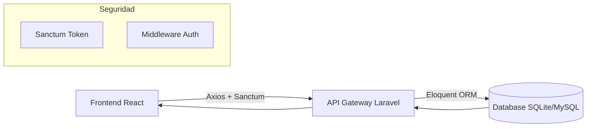

# Sistema de Información Gerencial para la Gestión Integrada del Flujo Turístico en la Provincia de Cusco

[](https://laravel.com/)
[](https://react.dev/)
[](https://www.typescriptlang.org/)
[](https://tailwindcss.com/)
[](LICENSE)

---

## 📖 1. Resumen Ejecutivo
Este proyecto surge como una respuesta tecnológica a la desarticulación de la información turística en la región de Cusco. Diseñado bajo los principios de los **Sistemas de Información Gerencial (SIG)**, la plataforma integra datos críticos de flujo de visitantes, oferta de servicios y capacidad de carga de atractivos arqueológicos en una sola interfaz unificada para la toma de decisiones estratégicas.

---

## 🎯 2. Objetivos Estratégicos

### 2.1. Objetivo General
**Diseñar e implementar un Sistema de Información Gerencial (SIG)** integrado para la gestión del flujo turístico en la provincia de Cusco, permitiendo la consolidación, procesamiento y visualización de datos provenientes de entidades públicas (DIRCETUR, MPC, COSITUC) y privadas.

### 2.2. Objetivos Específicos
*   **Diagnóstico de Interoperabilidad:** Evaluar los silos de información actuales en las instituciones gubernamentales de Cusco.
*   **Arquitectura de Datos Escalable:** Definir un modelo de datos relacional capaz de soportar registros masivos (Stress Testing) de visitantes y operadores.
*   **Visualización Gerencial:** Implementar dashboards dinámicos con KPIs de ocupación y saturación en tiempo real.
*   **Estandarización de Procesos:** Digitalizar el registro de entrada de visitantes, eliminando la dependencia de procesos manuales.

---

## 🏗️ 3. Arquitectura del Sistema

El sistema utiliza una arquitectura de **Desacoplamiento Total** entre el Cliente y el Servidor.

### 3.1. Flujo de Datos


### 3.2. Estructura de Directorios
*   `/frontend`: Aplicación SPA construida con React + Vite.
    *   `/src/components`: Componentes atómicos y de UI (Modales, Tablas, Gráficos).
    *   `/src/lib`: Configuración de API y utilidades de estado.
    *   `/src/pages`: Vistas principales (Dashboard, Visitantes, etc.).
*   `/backend`: API robusta construida con Laravel 11.
    *   `/app/Http/Controllers`: Lógica de negocio y gestión de recursos.
    *   `/database/seeders`: Generadores de datos masivos para pruebas de carga.
    *   `/routes/api.php`: Definición de endpoints protegidos.

---

## 💻 4. Stack Tecnológico Detallado

### 4.1. Frontend (Premium UI)
*   **React 19 & TypeScript:** Tipado estricto para evitar errores en tiempo de ejecución.
*   **Tailwind CSS 4:** Uso intensivo de variables CSS y diseño "Glassmorphism" (desenfoques y transparencias).
*   **Zustand:** Estado global ultra-ligero para persistencia de sesión.
*   **Lucide React:** Set de iconos vectoriales consistentes.
*   **Vite 6:** Bundler de última generación para tiempos de carga instantáneos.

### 4.2. Backend (Robust API)
*   **Laravel 11:** Aprovechando las nuevas optimizaciones de rendimiento y simplicidad de rutas.
*   **PHP 8.2+:** Funciones avanzadas de tipado y rendimiento JIT.
*   **Laravel Sanctum:** Autenticación basada en tokens para SPAs.
*   **FakerPHP:** Implementación de lógica personalizada para generar 300+ registros coherentes de flujo turístico.

### 4.3. Base de Datos
*   **Motor:** SQLite (Desarrollo) / PostgreSQL (Producción).
*   **Tablas Principales:**
    *   `visitors`: Datos personales, nacionalidad, fecha/hora de ingreso y sitio visitado.
    *   `tourist_sites`: Nombre, categoría, capacidad de carga máxima y entidad administradora.
    *   `tourism_operators`: RUC, razón social, licencias DIRCETUR y estado operativo.
    *   `certified_guides`: Carnet profesional, idiomas y especialidad.

---

## 🚀 5. Funcionalidades de Gestión Gerencial

### 📊 Dashboard de Monitoreo (BI)
*   **Monitor de Capacidad:** Mapa interactivo de Cusco (Google Maps API) con indicadores de saturación.
*   **Estadísticas en Tiempo Real:** Gráficos de barras y circulares sobre el tipo de visitante (Nacional vs. Extranjero).
*   **Alertas de Mantenimiento:** Visualización de sitios con acceso restringido o cerrado.

### 📝 Registro y Control (CRUD)
*   **Inyección masiva de datos:** Capacidad de procesar cientos de registros simulados para análisis de tendencias.
*   **Modales de Registro Premium:** Formularios con validación inmediata para el registro de visitantes y operadores.
*   **Gestión de Permisos:** Sistema basado en roles para diferenciar personal técnico de gerencial.

---

## 🛠️ 6. Guía de Instalación Avanzada

### Requerimientos de Sistema
*   **Servidor Web:** Apache / Nginx.
*   **PHP:** >= 8.2 con extensiones `sqlite3`, `bcmath`, `ctype`, `json`, `mbstring`, `openssl`, `pdo`, `tokenizer`, `xml`.
*   **Node.js:** >= 18.0.0.

### Procedimiento de Despliegue Local

1.  **Repositorio:**
    ```bash
    git clone https://github.com/JosephCC123/GERENCIALES-SISTEMA.git
    cd GERENCIALES-SISTEMA
    ```

2.  **Servidor API (Backend):**
    ```bash
    cd backend
    composer install
    cp .env.example .env
    php artisan key:generate
    # Configurar DB_CONNECTION=sqlite en .env
    touch database/database.sqlite
    php artisan migrate:fresh --seed # Genera 300+ registros masivos
    php artisan serve --port=8001
    ```

3.  **Interfaz de Usuario (Frontend):**
    ```bash
    cd ../frontend
    npm install
    npm run dev
    ```

---

## 📈 7. Impacto Institucional (Caso Cusco)
El uso de este sistema permite a la **Municipalidad Provincial del Cusco**:
1.  **Reducir la Informalidad:** Al centralizar el registro de operadores y guías, se facilita la fiscalización.
2.  **Optimizar el Flujo:** Identificar picos de saturación en sitios arqueológicos para redistribuir el flujo hacia atractivos menos visitados.
3.  **Transparencia de Datos:** Proporcionar reportes precisos para el Plan de Gobierno Digital 2024-2026.

---

## 🤝 8. Contribución y Soporte
Este proyecto es una iniciativa de investigación formativa. Para reportar errores o proponer mejoras, por favor abra un *Issue* en el repositorio.

**Cusco - Ombligo del Mundo 🌍**